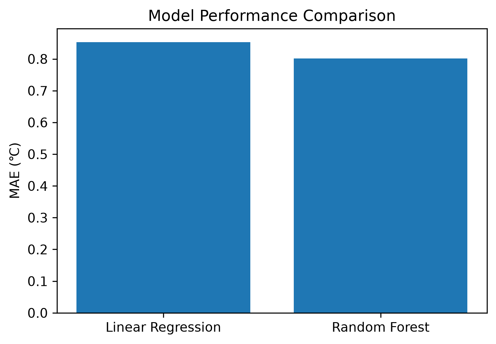
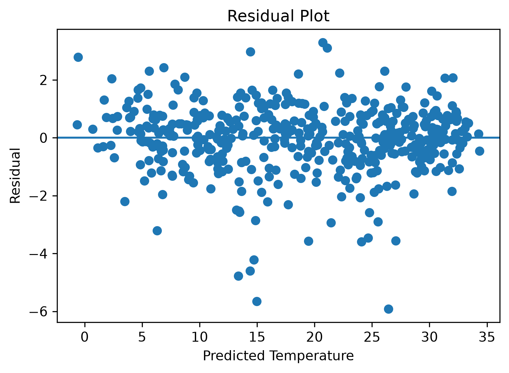
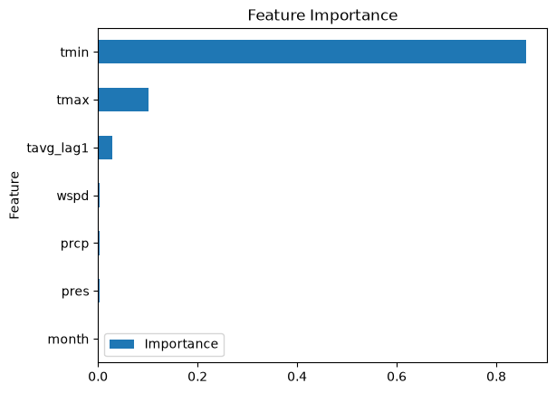

# Hangzhou Temperature Prediction

A machine learning project predicting daily average temperature in Hangzhou using historical weather data.

## Dataset

Weather data was collected from Meteostat, including:

- Minimum temperature
- Maximum temperature
- Precipitation
- Wind speed
- Pressure
- Date information

The dataset contains approximately five years of historical weather records.

## Methods

I built and compared two regression models:

1. Linear Regression as a baseline model
2. Random Forest Regression

To capture the dependency of weather conditions over time, I introduced a temporal feature:

- Previous-day temperature (lag feature)

## Results

The models were evaluated using:

- Mean Absolute Error (MAE)
- R² Score

Random Forest achieved:

MAE: 0.80
R²: 0.9848
## Feature Importance

The model showed that previous-day temperature was the most important factor for short-term temperature prediction.

## Future Work

Future improvements may include:

- Connecting real-time weather APIs
- Updating predictions automatically
- Exploring advanced time-series models
- ## Visualisations

### Model Comparison

### Residual Plot

### Feature Importance

